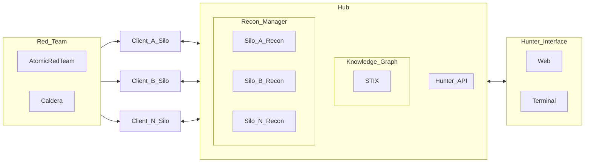

# ThreatHunter

A modular tool for auditing hybrid environments.


## Overview

**ThreatHunter** is an open-source framework designed for on-prem and cloud environments. 

* Continuously ingests logs, cloud events, telemetry, and container behavior from multiple clients, called Silos.
* Correlates activity against **MITRE TTPs** using a knowledge graph in a central Hub.
* Uses **recon**: curated detection queries.
* Integrates with **OSINT feeds**, **CTI platforms**, and **Sigma rules** for threat-analysis.
* Generate reports of a Silos activity.
* Terminal and Web interfaces for framework management.

## Architecture


## Tech Stack & Tools

| Area               | Tools/Technologies                                            |
| ------------------ | ------------------------------------------------------------- |
| Detection Logic | MITRE ATT\&CK, Sigma rules, STIX                  |
| Programming     | C++ gRPC for high-performance collection, raw and pcap traffic capture    |
| Query Support   | KQL (Azure tbd), SQL (PostgreSQL), SPL (Splunk tbd)      |
| Cloud/Container | AWS CloudTrail, Azure Monitor (tbd), GCP Logging (tbd), Falco (K8s tbd)       |
| Frontend        | Some frontend, CLI                    |
| Automation      | GitHub Actions, Docker, YAML-based pack definitions           |
| CTI/OSINT      | Abuse.ch, GreyNoise, VirusTotal API, Shodan                   |
| Red Team Sim    | Atomic Red Team, Caldera for penetration testing Silos                |
| Reports         | Generate reports of CTI and penetration results               |

---


## Recon 

Modular YAML-based detection rules, aligned to MITRE ATT\&CK.

Example:

```yaml
id: T1059.003
name: Command and Scripting Interpreter: Windows Command Shell
query: SELECT * FROM sysmon_logs WHERE event_data LIKE '%cmd.exe%'
platform: windows
severity: high
confidence: 80
```

* Stored in: `recon/`
* Categories: `initial-access/`, `lateral-movement/`, `persistence/`, etc.

Build your own or contribute via PR.

---


## Simulate Adversaries (Red Team)

Integrate Atomic Red Team or Caldera to simulate:

* Credential dumping
* Cloud misconfigurations
* Reverse shells inside containers

```bash
./scripts/simulate T1548.001   # Run a privilege escalation test
```

---


## Query Engine Support

| Engine      | Description                        |
| ----------- | ---------------------------------- |
| KQL (tbd)         | Azure Sentinel, Microsoft Defender |
| SPL (tbd)        | Splunk                             |
| SQL        | PostgreSQL, SQLite (via `osquery`) |
| Elastic DSL (tbd)| ElasticSearch queries              |

---


## OSINT & CTI Integration

* [ ] MISP
* [ ] GreyNoise
* [ ] Abuse.ch
* [ ] Shodan (API)
* [ ] VirusTotal

---


## Project Metrics

Once deployed, ThreatHunter provides:

* :checkmark: % of MITRE TTP coverage
* :clock: Mean detection latency
* :pin: Geographic/log source distribution
* :brain: Detection accuracy over time

---


## Contributing

We welcome community PRs, detection logic, integrations, and bug fixes.

```bash
git checkout -b feature/new-recon
git commit -m "Add detection for T1218.011"
git push origin feature/new-recon
```

Please review the [CONTRIBUTING.md](CONTRIBUTING.md) for details.

---


## Resources

* [MITRE ATT\&CK Matrix](https://attack.mitre.org/matrices/enterprise/)
* [Sigma Rules](https://github.com/SigmaHQ/sigma)
* [Atomic Red Team](https://www.atomicredteam.io/)
* [Caldera](https://caldera.mitre.org/)
* [Greynoise](https://www.greynoise.io/)
* [Awesome Threat Hunting](https://github.com/endepointe/awesome-threat-detection)
* [grpc Namespace Reference](https://grpc.github.io/grpc/cpp/namespacegrpc.html)
* [STIX2](https://stix2.readthedocs.io/en/latest/)
* [Attack Stix Data](https://github.com/mitre-attack/attack-stix-data/)
* [MitreAttack Python](https://github.com/mitre-attack/mitreattack-python/)

---


## 🛡️ License

MIT License © 2025 EndePointe / ThreatHunter Team

---


## 🙋 Contact

Questions, ideas, or just want to collaborate? Open a PR to get started.

```
